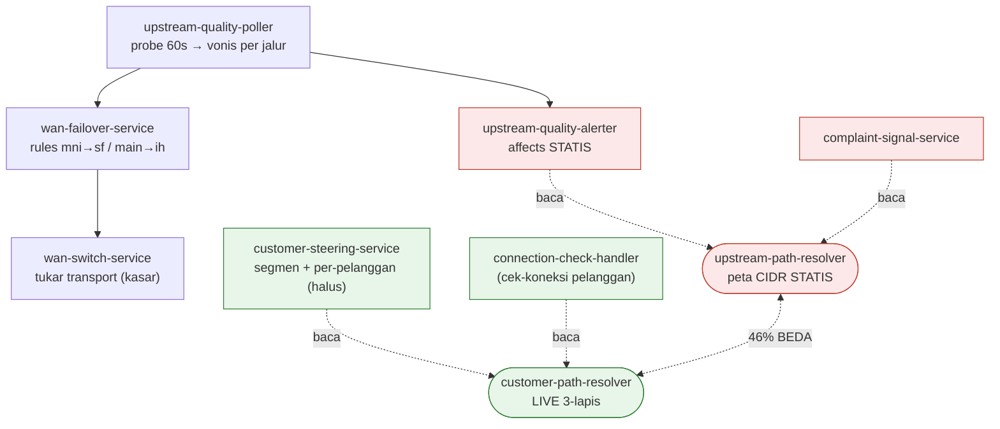
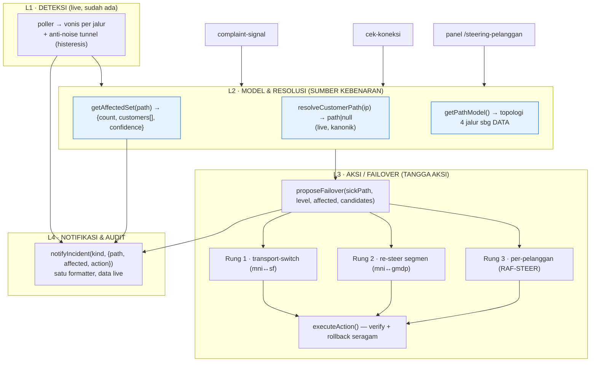

# Blueprint — Standarisasi Upstream Down/Pulih & Failover (RAF-DANDER multi-ISP)

> Status: **USULAN / belum diimplementasi** · Dibuat 2026-07-13 · Lingkup: RAF-DANDER (bot multi-ISP).
> Dokumen ini membekukan struktur target sebelum menyentuh kode. Tujuan: menyatukan mekanisme yang
> sudah ada (bukan menambah fitur) supaya deteksi → dampak → aksi → notifikasi benar-benar konsisten.

---

## 0. Ringkasan eksekutif

Deteksi **jalur mana down/pulih** sudah live & wajar. Yang membuat terasa "belum matang" ada di 3 lapis
interpretasi di atasnya:

1. **Peta jalur → pelanggan** dihitung dua cara yang tidak sinkron (statis vs live) — terbukti **beda 46%**
   pada 63 sesi live (2026-07-13).
2. **Dua primitif "pindah trafik"** (transport-switch kasar vs customer-steering halus) hidup terpisah,
   dipicu & dinotifikasi terpisah, memakai peta pelanggan yang berbeda.
3. **Teks "Terdampak" statis** tersebar di ≥3 config (`upstreamMonitor.paths[].affects`,
   `wanSwitch.switches[].affects`, aturan failover) dan **guardrail tak seragam** (drift-monitor OFF,
   usulan revert nge-spam, ambang deteksi terlalu sensitif untuk tunnel).

**Keputusan arah:** standarisasi = **konsolidasi ke satu model kanonik**, bukan rewrite mesin.

---

## 1. Bukti (as-is, dari production 2026-07-13, read-only)

| Gejala | Bukti live/insiden | Akar (file:line) |
|---|---|---|
| Terdampak ≠ realita | Resolver **statis** `{mni:43, gmdp:14, unknown:6}` vs **live** `{gmdp:43, mni:20}` → **29/63 (46%) beda** | [upstream-quality-alerter.js:260](../lib/upstream-quality-alerter.js) baca `paths[].affects` statis |
| Komplain salah ISP | 23 pelanggan `192.168.62.x` sudah di gmdp (lokaldns), statis masih bilang mni | [complaint-signal-service.js:93](../lib/complaint-signal-service.js) pakai resolver statis |
| Alert berisik/kontradiktif | **14/38 episode < 5 mnt**; **12 alert bersegmen `SEHAT`** (classifier bilang sehat, alert tetap teriak) | `cycleLevel` DEGRADASI di loss ≥5% ([alerter:46](../lib/upstream-quality-alerter.js)); 1 ping hilang/10 = alert |
| Failover nge-spam | 6× `revert_propose` dalam 12 jam utk satu switch manual; usul `main-to-ih` saat loss 20–30% | [wan-failover-service.js](../lib/wan-failover-service.js) re-propose tiap `proposeCooldownMinutes` |
| `service-down` bocor | tiap gmdp mati 7/7, backup ih/mni/sf serempak lapor 3/7 | probe layanan per-jalur tak terisolasi |
| Drift tak terpantau | `steeringDriftMonitor` = OFF di prod (config `null`), padahal peta pool 46% basi | [steering-drift-monitor.js](../lib/steering-drift-monitor.js) gated OFF |

Sebagian noise MNI **nyata** (event `flap`: Tunnel-MNI `link_downs` 48→51, uptime reset) — MNI itu tunnel L2TP.
Maka perbaikan L1 = **membedakan "tunnel blip" vs "ISP down"**, bukan sekadar menaikkan ambang buta.

### 1.1 Peta modul saat ini (fragmented)

Perhatikan: `wan-switch`/`wan-failover` dan `customer-steering` **tidak pernah bertemu** — dua jawaban atas
pertanyaan yang sama ("jalur X sakit → ungsikan trafik ke mana") tanpa model pelanggan bersama.

---

## 2. Arsitektur target (to-be) — 4 lapis, satu sumber kebenaran

**Prinsip inti:** semua konsumen (alerter, komplain, panel, cek-koneksi, failover) membaca **L2 yang sama**.
Tidak ada lagi peta pelanggan paralel.

---

## 3. Kontrak fungsi (heart of "matang")

Legenda: **[ADA]** = sudah ada, jadikan kanonik · **[BARU]** = fungsi usulan · **[UBAH]** = ganti sumber data.

### L2 — Model & Resolusi (satu sumber kebenaran)

| Fungsi | Status | Kontrak |
|---|---|---|
| `resolveCustomerPath(ip)` | **[ADA]** [customer-path-resolver.js:153](../lib/customer-path-resolver.js) | `→ 'gmdp'\|'mni'\|'ih'\|'sf'\|null`. 3-lapis live; **fail-closed** (`null` = tak bisa dipastikan). Jadikan **satu-satunya** resolver runtime. |
| `getPathModel()` | **[BARU]** | `→ { paths: [{ key, label, role:'utama'\|'direct'\|'tunnel'\|'backup', transport, carriesCustomers:bool, healthyCandidates:[key] }] }`. Ganti string `affects` statis dengan **topologi sebagai data**. |
| `getAffectedSet(path, {sample})` | **[BARU]** | `→ { path, count, customers:[{name,ip,paket}], confidence:'live'\|'stale'\|'unknown' }`. Satu fungsi dipakai **semua** L4/komplain/failover. Sumber = `resolveCustomerPath` × PPPoE aktif live. `confidence:'unknown'` bila router tak terbaca — **jangan** karang angka. |
| `resolvePathForIp(ip,cfg)` | **[ADA→turunkan]** [upstream-path-resolver.js](../lib/upstream-path-resolver.js) | Tetap ada **hanya** sebagai jaring pengaman internal `resolveCustomerPath` lapis-3 + input drift. **Bukan** dipanggil langsung oleh alerter/komplain lagi. |

### L3 — Aksi / Failover (tangga aksi)

| Fungsi | Status | Kontrak |
|---|---|---|
| `proposeFailover({sickPath, level, affected, candidates})` | **[BARU]** | `→ action \| null`. Pemilih rung (lihat §4). Murni/pure: tak menulis router, hanya memutuskan. |
| `executeAction(action, {actor, confirm})` | **[BARU]** pembungkus | `→ {ok, verified, rolledBack, detail}`. Delegasi ke primitif di bawah, seragamkan verify+rollback+audit. |
| `wanSwitch.applySwitch/restoreSwitch(id)` | **[ADA]** [wan-switch-service.js:12](../lib/wan-switch-service.js) | Rung 1. Allowlist `config.wanSwitch.switches` (`mni-to-sf`, `main-to-ih`). |
| `steering.applySegmentMove({segment,path,confirm,actor})` | **[ADA]** [customer-steering-service.js](../lib/customer-steering-service.js) | Rung 2. Sudah verify+rollback. |
| `steering.steerCustomer({userId,path,actor})` | **[ADA]** | Rung 3. Override per-pelanggan RAF-STEER. |

### L4 — Notifikasi & Audit

| Fungsi | Status | Kontrak |
|---|---|---|
| `notifyIncident(kind, {path, affected, action, report})` | **[BARU]** formatter tunggal | Semua alert (down/pulih/failover/komplain) lewat sini; baris "Terdampak" **selalu** dari `getAffectedSet`. Template `upq_*` / `wanfail_*` — **slot baru wajib ditambah ke `database/*_templates.json`, bukan cuma fallback** (lihat §7). |
| `upstream-quality-alerter` | **[UBAH]** | Ganti `buildDirectionText` baris `affects` statis → `getAffectedSet(path)`. |
| `complaint-signal-service` | **[UBAH]** | Ganti `resolvePathForIp` (statis) → `resolveCustomerPath` (live). Hormati `null` (jangan cluster "unknown" jadi 1 jalur). |

---

## 4. Tangga aksi failover (decision ladder)

Diberi jalur sakit + level + himpunan-terdampak-live + kesehatan kandidat, engine memilih **satu** rung:

| Rung | Aksi | Kapan dipilih | Primitif | Contoh |
|---|---|---|---|---|
| **1** | **Transport-switch** (tukar transport di bawah grup yang sama) | Jalur **tunnel** sakit (`mni`/`sf`) TAPI ISP tujuan masih hidup via backup | `wanSwitch.applySwitch('mni-to-sf')` | MNI(L2TP) rusak → alirkan mark MNI lewat SF |
| **2** | **Re-steer segmen antar-ISP** | Satu **ISP** beneran down & ISP tujuan sehat + kapasitas cukup | `steering.applySegmentMove({segment, path})` | GMDP down → pindah segmen 125k ke MNI |
| **3** | **Per-pelanggan** | Kasus individual / pilot / VIP | `steering.steerCustomer({userId, path})` | 1 pelanggan diarahkan manual |

**Aturan pemilihan (draft):**
- Default **`propose`** (usul ke owner), bukan auto-apply, sampai owner menaikkan mode per-rung.
- Rung 1 diutamakan bila `sickPath.transport==='tunnel'` dan ada backup transport sehat (paling murah, tak ubah ISP/QoS pelanggan).
- Rung 2 hanya bila kandidat ISP `healthy N siklus` **dan** headroom kapasitas (hindari mindahin beban ke jalur yang lalu ikut jenuh).
- Rung 3 tak pernah otomatis — selalu manual.

---

## 5. Guardrail seragam (satu set untuk semua aksi)

| Guardrail | Aturan | Menyembuhkan |
|---|---|---|
| **Propose-once** | Satu usulan per *kondisi*, bukan re-nag tiap cooldown | 6× revert-spam |
| **Cooldown + cap harian** | `cooldownMinutes`, `maxAutoActionsPerDay` (sudah ada di wanFailover) — seragamkan ke semua rung | over-action |
| **Flap-lock** | `flapLockCount`/`flapLockHours` — kunci jalur yang baru saja bolak-balik | ping-pong |
| **Fail-closed** | Status/affected `unknown` → **abort aksi + eskalasi admin**, jangan tebak | aksi di atas data buta |
| **Verify + rollback** | Tiap apply cek route hasil; tak cocok → rollback + alert | topology-drift |

---

## 6. Anti-noise deteksi (L1 tuning)

- **Ambang per-jenis-jalur:** tunnel (`mni`/`sf`) butuh `needSick` lebih besar / ambang loss lebih tinggi
  daripada jalur direct (`gmdp`/`ih`). MNI wajar drop sesekali → jangan diperlakukan seperti fiber.
- **Gate DEGRADASI dengan segmen:** bila classifier = `SEHAT` **dan** gateway bersih **dan** util rendah →
  **tahan** alert (turunkan ke catatan, bukan alarm). Hentikan 12 "alert SEHAT" yang kontradiktif.
- **Bukti reboot/pulih dari uptime, bukan heartbeat** (prinsip yang sudah dianut di reboot-followup) —
  terapkan sama untuk "pulih": butuh N siklus bersih **plus** tak ada `flap` baru.

---

## 7. Rencana bertahap (P0–P3)

Tiap fase: di belakang gate config, test-first, satu commit, bisa rollback. **Tak ada big-bang.**

| Fase | Isi | File utama | Efek |
|---|---|---|---|
| **P0** | L2 kanonik: `getPathModel` + `getAffectedSet`; wire ke alerter (`buildDirectionText`) & komplain (resolver) | alerter, complaint-signal, customer-path-resolver, (baru) affected-service | **Sembuhkan keluhan 46% + salah-atribusi komplain** |
| **P1** | L1 anti-noise: ambang per-jenis-jalur + gate segmen-SEHAT | upstream-quality-poller, upstream-quality-alerter | Hentikan alert berisik/kontradiktif |
| **P2** | L3 tangga aksi: `proposeFailover` + `executeAction` + guardrail seragam; satukan wan-failover ↔ steering | (baru) failover-orchestrator, wan-failover-service, customer-steering-service | Satu vocab failover, no spam |
| **P3** | Nyalakan `steeringDriftMonitor` + observability (isolasi `service-down` per jalur) | steering-drift-monitor, service-reachability-prober | Drift ketahuan dini; alert layanan akurat |

---

## 8. Invariant & risiko (WAJIB dipatuhi saat implementasi)

- **Single-instance** — state failover in-memory + rehidrasi dari insiden; jangan bikin aksi ganda.
- **Template override fallback** — tiap slot baru di alert **wajib** masuk `database/*_templates.json` (kalau
  tidak, section dihitung tapi tak terkirim — bug klasik proyek ini).
- **`sendCritical(jid, {text}, opts)`** — payload harus `{text}`; notifikasi never-throw.
- **Fail-closed** — "tak bisa observasi" ≠ "observasi buruk". Router tak terbaca → `null`/`unknown`, eskalasi admin.
- **Deploy** — prod bukan git repo; `pscp`+`plink`, `node --check` sebelum `pm2 restart`, backup dulu, `config.json`/`database/*.json` **merge-key** jangan timpa. Jangan `git add -A`.
- **Risiko utama:** menyatukan failover (P2) menyentuh jalur TULIS router → paling akhir, mode `propose`
  dulu, uji di panel sebelum WA-trigger.

---

## 9. Dampak dokumentasi

- Saat P0–P3 diimplementasi: tambah entri `docs/boundary-log.md` (owner baru: affected-service /
  failover-orchestrator; status jalur statis) + satu baris indeks di `SYSTEM_MAP.md`.
- Perbarui `SYSTEM_MAP.md` alur `poller → L2 → L3/L4`.

---

## 10. Pertanyaan terbuka (untuk disepakati sebelum P0)

1. **Auto vs propose** — sampai mana owner mau otomatis? (usul: semua `propose` dulu, kecuali Rung-1 mni↔sf yang sudah terbukti aman).
2. **Kapasitas kandidat** — apakah ada angka kapasitas per jalur (Mbps) untuk gating Rung-2? (config `paths[].capacity` masih kosong).
3. **Ambang tunnel** — sepakati `needSick`/loss untuk `mni`/`sf` berdasar telemetri (ukur distribusi dulu, jangan tebak — prinsip proyek).
4. **`getAffectedSet` tampilkan nama?** — alert ke owner: cukup jumlah + segmen, atau sertakan daftar nama pelanggan?
